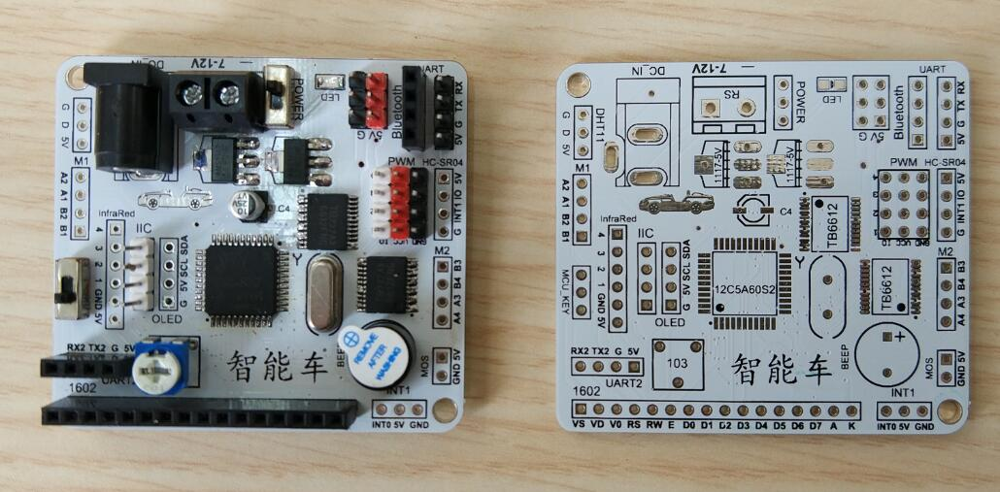
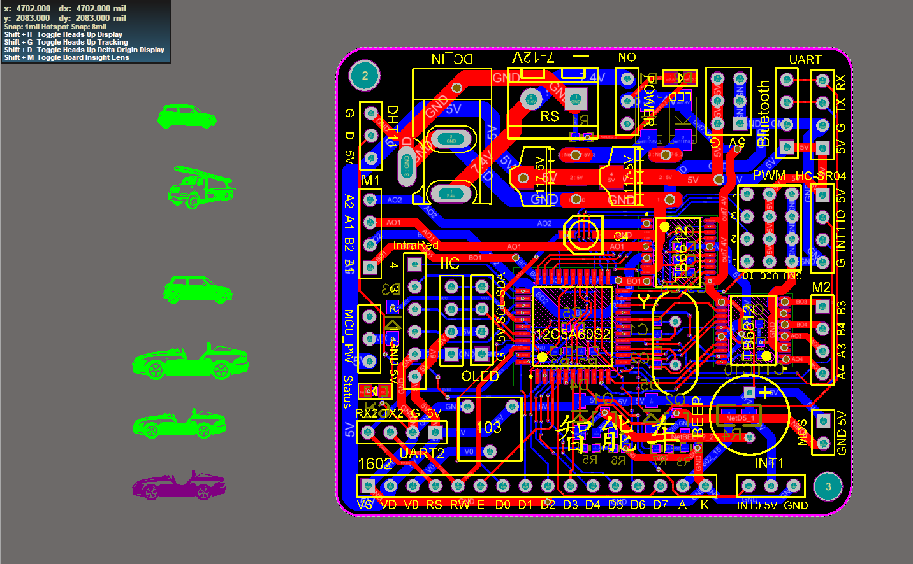

### 51单片机的智能车控制器
创建时间：2017年11月7日

此为51（主控为12C5A60S2）智能车的控制板，用来做网上最常见的智能车。可自行去STC官网下载STC12系列的芯片手册。

手机安装蓝牙APP连接串口蓝牙设备即可控制小车。（指令都在code的串口处理函数中）

关于PCB：如果需要把PCB文件中左边的车型图标添加进PCB，那么开板时最好不要覆铜（可能会被覆盖）。

#### 目录结构介绍
* IntelligentCarFor51 _（控制板的AD17电路工程文件）_
* Car_Code(STC12) _（控制板相对应的51单片机基础支撑程序 Keil4/MDK5工程）_
* Image

#### 控制器实物图

